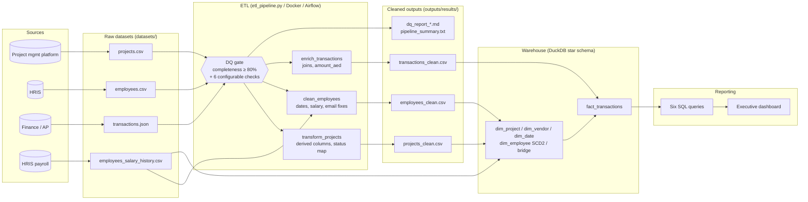

# Presight Data Governance Document

**Author:** Mohammed Faisal · **Date:** 2026-09-21 · **Scope:** `projects`, `employees`, `transactions`, `employees_salary_history`

> Retention periods below are conservative working defaults for the assessment. Statutory periods
> under UAE labour, tax and PDPL rules must be confirmed by Legal/Compliance before adoption.

---

## Section 1 — Data inventory

| Dataset | Source system | Format | Update frequency | Volume estimate | Daily growth |
|---|---|---|---|---|---|
| projects | Project management platform (operational DB export) | CSV | Daily batch export | 500 rows (~80 KB) | ~1–3 new projects/day; status/cost columns change daily |
| employees | HRIS | CSV | Daily batch export | 1,000 rows (~130 KB) | A few hires/leavers per week |
| transactions | Finance / Accounts Payable system | JSON (array of records) | Daily batch (near-real-time capable) | 50,000 rows (~14 MB) | ~30–40 rows/day (2022-01 → 2026-08 ≈ 1,670 days) |
| employees_salary_history | HRIS payroll module | CSV | Event-driven (hire / raise / promotion), exported daily | 1,826 rows (~250 KB) | Almost 0 – one row per salary/role change |

`transactions` is the only fast-growing dataset; it is the first candidate for incremental (append-only) loading.

---

## Section 2 — Data classification

| Classification | Definition |
|---|---|
| **Public** | Non-sensitive, shareable externally |
| **Internal** | Internal use only, no regulatory requirement |
| **Confidential** | Sensitive business data — restricted access |
| **Personal (PII)** | Personal identifiable information — regulatory requirements apply |

### projects.csv

| Column | Classification | Notes |
|---|---|---|
| project_id, project_name | Internal | |
| department, region, status, priority | Internal | |
| start_date, end_date | Internal | |
| budget, actual_cost | **Confidential** | Financial position of the business |
| project_manager_id | Internal | Becomes PII only when joined to the employee name |
| *derived:* budget_variance, is_over_budget, budget_utilisation_pct, risk_level, status_category, duration_days | Confidential / Internal | Inherit the classification of the inputs (variance/utilisation → Confidential) |

### employees.csv

| Column | Classification | Regulation |
|---|---|---|
| employee_id | Internal | Pseudonymous key; PII when linked to a name |
| full_name | **PII** | GDPR + UAE PDPL |
| email | **PII** | GDPR + UAE PDPL |
| hire_date | **PII** | GDPR + UAE PDPL (personal employment record) |
| salary | **PII + Confidential** | GDPR + UAE PDPL (compensation of an identifiable person) |
| manager_id | Internal | FK; PII once resolved to a name |
| department, role, level, region, status | Internal | Level/role are internal; combined with name they form part of the employment record |
| years_experience | Internal | |
| *derived:* dq_flags | Internal | Audit column, no personal content |

### transactions.json

| Column | Classification | Regulation |
|---|---|---|
| transaction_id, invoice_ref | Internal | |
| project_id | Internal | |
| vendor_id, vendor_name | Confidential | Commercial relationships (vendors are companies, so not personal data; sole-trader vendors would become PII) |
| category, payment_status, currency | Internal | |
| amount, transaction_date | **Confidential** | Financial data |
| approved_by | **PII** | Employee identifier attached to a business decision — GDPR + UAE PDPL |
| notes | Internal | Free text — must be scanned for accidental personal data |
| *derived:* approver_name | **PII** | GDPR + UAE PDPL |

### employees_salary_history.csv

| Column | Classification | Regulation |
|---|---|---|
| employee_id | Internal (PII when linked) | GDPR + UAE PDPL |
| previous_salary, new_salary | **PII + Confidential** | GDPR + UAE PDPL |
| previous_role, new_role, previous_level, new_level | **PII** | Employment record of an identifiable person — GDPR + UAE PDPL |
| effective_date | **PII** | GDPR + UAE PDPL |
| change_type, change_reason | **PII + Confidential** | Reasons such as retention or market adjustment are sensitive HR information — GDPR + UAE PDPL |

**Regulation note.** The GDPR applies if data of EU residents is processed or a Presight entity is
established in the EU; the **UAE Federal Decree-Law No. 45 of 2021 (PDPL)** applies to personal data
processed in the UAE. Presight operates in the UAE, so both frameworks are treated as applicable to all PII columns.

---

## Section 3 — Data ownership

| Dataset | Data Owner (role) | Data Steward (role) | Access approver |
|---|---|---|---|
| projects | Head of PMO / Delivery | PMO data analyst | Head of PMO |
| employees | Chief People Officer (HR Director) | HRIS administrator | Chief People Officer + DPO for bulk exports |
| transactions | Finance Director / CFO | Finance systems analyst | Finance Director |
| employees_salary_history | Chief People Officer (with CFO consulted) | Compensation & Benefits specialist | Chief People Officer (named individuals only, time-boxed) |

**Owner vs Steward.** The *Data Owner* is the accountable business executive: decides who may use the data,
for what purpose, how long it is kept, and accepts the risk. The *Data Steward* is the day-to-day custodian:
maintains definitions and quality rules, resolves data-quality issues, keeps the catalogue and access lists
current, and enforces the owner's decisions. The owner sets policy; the steward runs it.

---

## Section 4 — Retention policy

| Dataset | Retention | Justification | Disposal | Enforced by |
|---|---|---|---|---|
| projects | 7 years after project closure | Business need: benchmarking, audit of delivery and cost; tax audit look-back covers project spend | Archive to cold storage at year 3, delete at year 7 | Data Steward (PMO) via scheduled archival job |
| employees | Active employment + 5 years after leaving (conservative; Legal to confirm the statutory period) | HR records needed for disputes, end-of-service, audits; PDPL requires no longer than necessary | Anonymise (drop name, email, hire date, salary; keep level/department for analytics) after the period | HRIS administrator; DPO audits annually |
| transactions | 7 years from transaction date | Finance and tax record-keeping (UAE VAT law 5 years; corporate tax 7 years — use the longer) plus audit | Archive after 2 years to read-only storage; delete at 7 years | Finance systems analyst |
| employees_salary_history | **10 years after employment ends** (longer than the general employee record) | Regulatory: end-of-service gratuity calculation, labour disputes and wage-protection / tax audits need the full pay history, and salary history may be the only proof of past pay; business: compensation benchmarking | After the period: delete identifiable rows, retain only anonymised aggregates (band / level / year) | Compensation & Benefits specialist; DPO approves deletion |

**Why salary history is different.** It must be kept longer than the rest of the employee record because
labour law and tax rules can require proving historical pay long after employment ends, while it is also the
most sensitive dataset. The answer is *long retention with the tightest access*: encrypted, restricted to a
named HR group, no copies into analytics layers, and anonymised (not merely deleted) once the period ends so
salary-band analytics survive.

---

## Section 5 — Access control

Access levels: `None`, `Read`, `Read + Write`, `Full (including delete)`.

| Persona | Projects | Employees | Transactions | Salary History |
|---|---|---|---|---|
| Data Engineer | Read + Write | Read (PII columns masked) | Read + Write | **None** (pipeline service account only) |
| BI Analyst | Read | Read (masked names/emails/salary) | Read | **None** |
| Finance Team | Read | None (approver names only) | Read + Write | **None** |
| HR Team | None | Full (including delete) | None | Read + Write |
| Executive | Read | Read (aggregated only) | Read (aggregated) | **None** (aggregated bands on request) |

**Justification (least privilege).**
- Salary history is the most sensitive dataset: only HR touches it; engineers get a service-account path
  for the pipeline with no interactive access, and everybody else receives anonymised aggregates.
- Engineers need write access to projects/transactions to load and repair data, but see employees through
  masked views because they don't need salaries or emails to build pipelines.
- BI analysts and executives consume aggregated data; row-level PII is masked.
- Finance owns transaction data and can correct it, but has no reason to see employee records beyond the approver's name.
- Deletion rights are limited to the owner function (HR for employee data) and logged.

---

## Section 6 — Data lineage

**Where transformations happen:** type parsing and derived columns (`transform_projects`), rule-based
repair (`clean_employees`), joins and null handling (`enrich_transactions`), SCD2 versioning (`data_model.sql`).
**Where quality checks run:** (1) the DQ gate before transformation (blocks the Airflow DAG below 80% completeness),
(2) the full configurable framework after cleaning (reports in `dq_report_*.md`), (3) SCD2 validation queries in
the warehouse (no duplicate current rows, no overlaps, no gaps).
